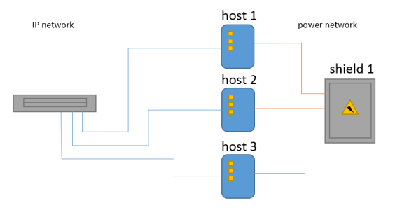

# About
The project's app pings web hosts to ensure they are up.\
If not, that means the power network is off.\
Then, the app sends an alarm message to specific ```Telegram``` and ```Viber``` users.


# Installation
1. Git clone the project:
   - ```git clone https://github.com/Mixail132/CheckServer.git```
2. Create a virtual environment:
   - ```python -m venv .venv```
3. Activate the virtual environment:
   - ```cd .venv/scripts```
   - ```activate.bat```
4. Install the project requirements:
   - ```pip install -r requirements.txt```
5. Save the ```example_vars.ini``` file as ```vars.ini```:
   - ```cd app```
   - ```copy example_vars.ini vars.ini```
6. Fill the ```vars.ini``` file with your data.
7. Make sure you have set up at least one ```Telegram``` or ```Viber``` bot.
8. If you haven't, create your ```Viber``` or ```Telegram``` bot.
9. Save the ```example_vars.ini``` file as ```vars.ini```:
   - ```cd app```
   - ```copy example_vars.ini vars.ini```
10. If you have Viberbot copy your logo file from ```static``` to the ```app``` folder:
    - ```copy static/your_viberbot_logo.jpg app/your_viberbot_logo.jpg```
11. Run the tests:
    - ```cd ..``` 
    - ```python -m pytest -с .github\settings\pytest.ini```
12. Run the script:
    - ```CheckServer.exe```

# Files & Folders
- .github - ```GitHub``` actions and linters settings;
- .temp   - linters and pytest cache files, build files;
- .venv   - virtual environment components;
-  app    - the project's application files;
    - audit.py - the project's main actions
    - builder.py - the ```CheckServer.exe``` file builder;
    - CheckServer.exe - tha main output executable project's file;
    - example_vars.ini - the project's configuration variables example;
    - vars.ini - a user's configuration and secret variables;
    - linter.py - the code checking with launching linters;
    - your_viberbot_logo.jpg - the ```Viber``` bot logo file;
    - dirs.py - the relative path's to the project's folders;
    - main.py - the project's main logic handler;
    - telegram.py - ```Telegram``` bot logic and settings;
    - viber.py  - ``Viber`` bot logic and settings;
    - vars.py - the project's configuration file reading;
-  static - images and media files;
    - ico.ico - the ```CheckServer.exe``` icon;
-  tests  - the project's tests.
-  requirements.txt - the project's Python modules.
